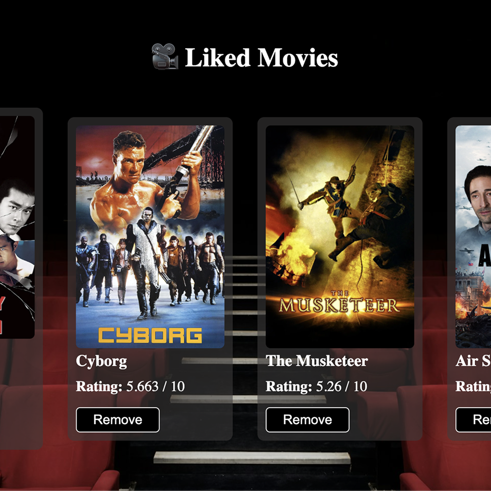

# 🎬 Movie Finder App

A simple and fun web app that allows users to discover and like random movies by genre using The Movie DB API.

<h2>🚀 Live Demo</h2>

<p>Click below to try the live version of the app:</p>

<p style="margin-top: 10px;">
  <a href="https://jordymurgueitio.github.io/film-finder-app/" target="_blank" rel="noopener noreferrer">
    
  </a>
</p>

## 📸 Screenshots

<div style="display: flex; flex-wrap: wrap; gap: 30px; justify-content: space-evenly;">
  
  
</div>

## ✨ Features

- 🎲 Get a random movie by genre
- 👍 Like and save your favorite movies (stored in `localStorage`)
- 🗂️ Show/hide your list of liked movies
- ❌ Remove movies from your liked list
- 🔄 Get a new random movie with like/dislike buttons
- 📱 Responsive design

## 🛠️ Built With

- HTML
- CSS
- JavaScript (ES6)
- [The Movie DB API](https://www.themoviedb.org/documentation/api)

## 📦 How to Run It Locally

1. Clone this repo:

   ```bash
   git clone https://github.com/jordymurgueitio/film-finder-app.git
   cd film-finder-app

   ```

2. Open index.html in your browser (or use Live Server)
3. ⚠️ Make sure to insert your own TMDB API key in the JS file:

```javascript
const tmdbKey = "YOUR_API_KEY_HERE";
```
