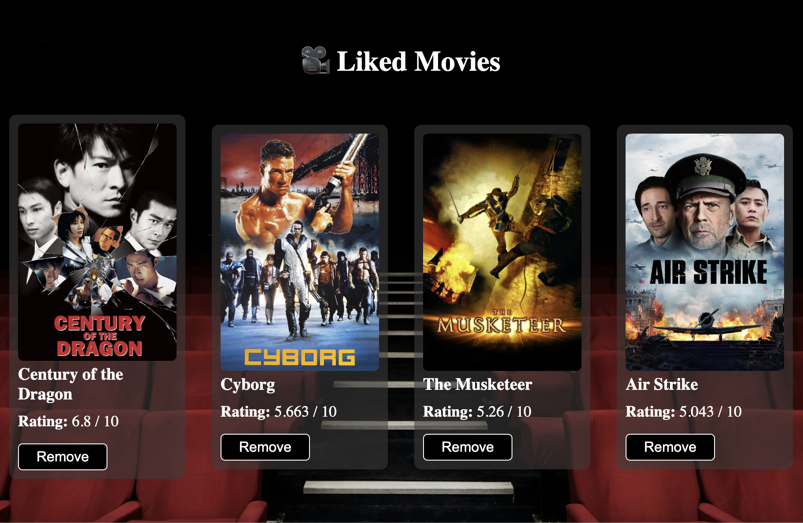

# 🎬 Movie Finder App

A simple and fun web app that allows users to discover and like random movies by genre using The Movie DB API.

## 🚀 Features

- 🎲 Get a random movie by genre
- 👍 Like and save your favorite movies (stored in `localStorage`)
- 🗂️ Show/hide your list of liked movies
- ❌ Remove movies from your liked list
- 🔄 Get a new random movie with like/dislike buttons

## 🛠️ Built With

- HTML
- CSS
- JavaScript (ES6)
- [The Movie DB API](https://www.themoviedb.org/documentation/api)

## 📸 Screenshots

<div style="display: flex; flex-wrap: wrap; gap: 10px; justify-content: center;">
  
  
</div>

## 📦 How to Run It Locally

1. Clone the repository:
   ```bash
   git clone https://github.com/yourusername/movie-finder-app.git
   ```
